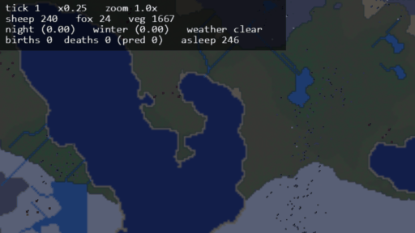
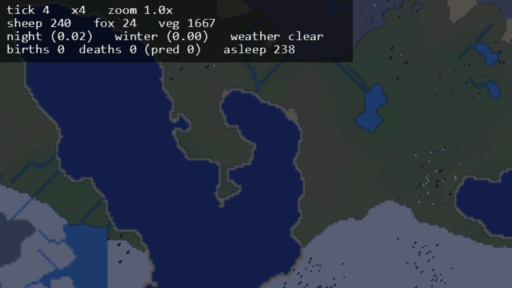
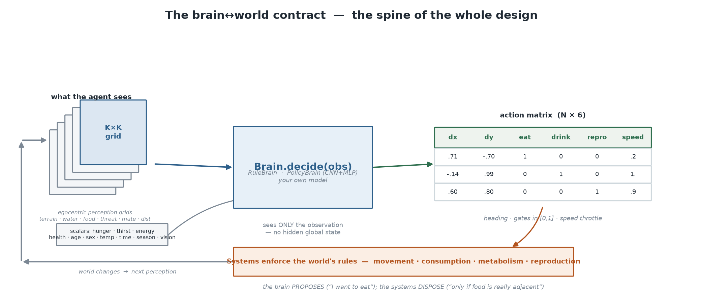
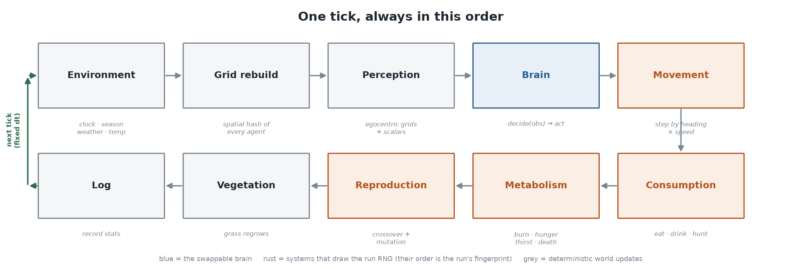
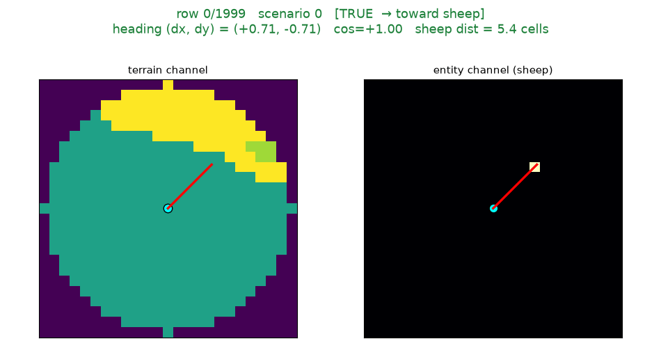
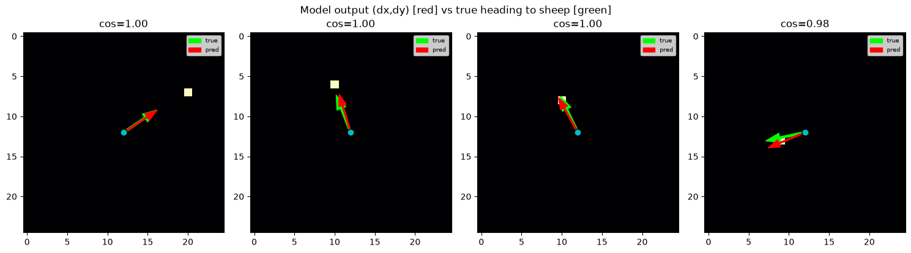
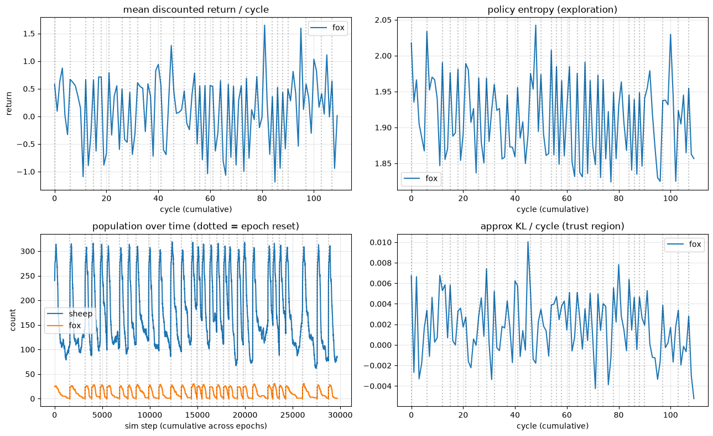

# darwinism: I built a world so I could watch things evolve

*A two-part series on building an AI friendly ecosystem-and-evolution
simulation — a whole planet of terrain, weather and seasons where agents as animals hunt, flee,
breed, and evolve across generations, where everything is engineered from the ground up so that a neural
network can one day take over their minds.*

*Part 1 of 2 — the idea, the world and the agents*

---


*(White dots are sheep. Red dots are foxes. The green haze is grass. A tiny black dot on an
animal's shoulder marks a male; the ones without are female.)*

## The Idea
I've always been a little obsessed with one question: **where does life come from?** How does
a pile of lifeless compounds ever become something that can move, breed, *think* — and then,
astonishingly, turn around and start unravelling the mystery of what it came from?  
We have
answers, but almost all of them are *hypothesis*: we read the clues left in today's world,
run the story backward to guess how things must once have been, and then hunt for whatever
else that guess would predict. It's clever, but it introduces many theories where only one of them can be actually true. Wouldn't it be much cooler to just *watch*
the animal evolve? But nothing worth evolves on a human lifescale and we will never live live long enough to see one. So I built a way to cheat.  
**In here, time is a dial I get to turn.** Ten
seconds of my afternoon can be a full day inside the world; whole generations can rise and
fall while my coffee goes cold. Evolution stops being a story I read about and becomes
something I can lean in and *watch happen*. The animals in it are built to be AI-friendly, in the sense that its brain never sees a
picture or an object — it only ever sees **numbers**. Perception hands it a small stack of
numeric grids centred on itself (what terrain is around me, where the water is, where the food
is, where the threats are), plus a short vector of how it's doing inside (health, hunger,
thirst, energy, age). The brain's answer is numbers too: which way to head, how hard to run,
and whether to eat, drink or breed. That's the entire conversation between a mind and this
world — numbers in, numbers out — which means the thing doing the deciding can be a page of
hardcoded rules today and a neural network tomorrow, and the world never notices the swap.
To push it further more i converted it to a framework where anyone can build around it, add rabit and make the fox chase, add a desease system which will wipe most species every 500 years, checkout the project to learn more https://github.com/afreediz/darwinism/.

# The World
Before anything can live, there has to be somewhere to live. The world is generated from
**layered simplex noise** — the same family of math that gives video games their rolling,
organic terrain. A few octaves of it become an elevation map; another becomes moisture. Those
two fields are the *only* real inputs. Everything else is derived from them:

- **Water** flows downhill. Rivers start from a handful of high-elevation sources and trace
  the steepest descent to the sea, pooling into lakes along the way. The ocean is simply
  everything below sea level.
- **Temperature** is latitude minus altitude — warm near the equator, cold up a mountain.
- **Biomes** fall out of the combination: wet and warm becomes forest; dry and hot becomes
  desert; cold becomes tundra; high becomes bare mountain; the rest is open plains.
- **Soil nutrients** and **plant suitability** follow the moisture and the lowlands, so grass
  is lush in the river valleys and sparse on the rocks.

I like that ordering because it's the one the real world uses. I never *place* a forest. I
place moisture and elevation, and the forest is what they imply. The map is a consequence, not
a decision.


*The same world, X-rayed into the raw fields. ocean mask, elevation, moisture, temperature, the biome labels, and the soil-nutrient pool. To the
animals none of this is a picture — it's just numbers on a grid.*

### The Beauty of Dynamicity -

A pretty map is scenery. What makes it a *world* is that it changes, and that the changes have
teeth. On top of the static terrain runs a small stack of moving parts:

- **Hydrology** — rivers carved from the mountains down to the sea, so fresh water is a
  *place* animals have to travel to, not a stat they top up anywhere.
- **Weather** that rolls between clear, rain and heat.
- **Seasons** that swing the temperature up and down as virtual years pass.
- **A day/night cycle**, because a world where nothing ever rests is missing half of biology.
- **Grass** growing in every cell up to what that soil can carry — thick on wet grassland, none
  on rock — so grazing strips a patch and the herd has to move on while it grows back.

these aren't decoration — each one reaches into the animals' arithmetic. It gets cold in
winter and the grass grows slower leading to food shortage. It gets hot and
animals get thirstier which keeps them closer to rivers. Night falls and they sleep. Each to swing species through different conditions forcing them to adapt.

## Seed system, determinism for a chaotic planet

**the world is completely reproducible.** Every stochastic thing that happens in a run — where
animals spawn, which way the weather turns, who catches whom, who breeds, how a genome mutates
— is drawn from a *single* seeded random generator that gets threaded through every system.
There is no hidden randomness anywhere, give it
the same seed and you get the same run back: tick for tick, down to the last byte.

Sitting next to that is the **world seed** — It is the map generator, feeds the terrain noise and the river carving.

That's what turns the toy into an instrument — hold one variable still, wiggle the other, and
whatever changed is a result rather than luck. Change one mechanism — how much cover the forest
gives, how fast grass regrows — rerun the *same* seed, and the difference in the population
curves belongs to that mechanism and nothing else. Sweep the same setup across fifty run seeds
and a single story turns into a distribution you can actually put a number on. Vary only the
world seed and you're asking whether a wetter planet carries more life, with the rules held
fixed. And swap a neural network in where the rule brain was — same map, same luck — and what
you're measuring is the mind, not the dice.

## We own's the TIME

The world hands you **control over time itself.** The simulation advances in fixed steps —
240 of them make a day in there — and how many of those steps you spend per second of *your*
time is entirely your call. Slow it down and one minute of sitting at your desk buys you ten
days inside the world: you can follow a single sheep around, watch it get thirsty, walk to a
river, drink, and wander off to find grass. Turn the dial the other way and that same minute
buys you a thousand days — three years of seasons, birth, starvation and mutation, gone past
while you're still holding the coffee. Nothing about the world changes when you do this. The
sheep doesn't know it's living faster. You've just decided how much of it you want to see.





The engine which runs whole logic and the viewer which present it as GUI are seperate. There's a
**live viewer** — a window, an observer, draws the pixels.
**headless runner** — which has no window at all and is where the real work happens. It is made this way because of frame rate, which is a ceiling that could limit us the amount of steps we can do per second, most game/GUI engine sets FPS limit as nobody can read 10,000 frames a second. Take the drawing
away and the ceiling disappears; the loop runs as fast as the cpu allows, no limit on how faster the world can run.


# The Agents

The world is the stage; the agents are the things that actually live on it. "Agent" here is
just the engineering word for an animal. Each one is a body with state (health, hunger, thirst,
energy, age, sex), a **genome** it inherits and passes on, and a **brain** that decides what to
do next — fed only an **egocentric local view**: a small window of the world centred on the
animal itself, out to the limit of its sensory range.

```
brain.decide(observation) -> action
```

The world hands a brain an **observation** — everything the animal can currently
perceive. The brain hands back an **action** — what it wants to do.



*Perception goes in as pure tensors; a decision comes out as a
plain matrix of numbers; the world's systems enforce what's actually allowed. Swap the middle
box — a rule brain today, a neural network tomorrow — and nothing else has to change. The rule-based brain and a future PyTorch
brain implement the **same interface**, take the **same observation**, and return the **same
action format**. You can choose which one drives each species at launch:*

```bash
# rule-driven sheep vs. a trained neural-network fox
darwinism-run --fox-brain models/fox.pt --ticks 20000
```

A neural fox hunting rule-based sheep. A learned sheep fleeing a scripted fox. Any mix. The
world doesn't know or care which is which — because they all speak through the same doorway.

> Natively there are only two animals — **sheep**, which eat grass, and
> **foxes**, which eat sheep. But darwinism is a framework, so you can add your own species, example :

```python
RABBIT = 2
cfg.species[RABBIT] = dw.SpeciesConfig(
    name="rabbit", species_id=RABBIT, init_count=90,
    diet=[dw.FieldFood("vegetation", eat_value=0.7)],       # herbivore
    gene_ranges={"max_speed": dw.GeneRange(0.8, 2.2), "burrow_depth": dw.GeneRange(0, 1), ...},
)
```

> Declare its diet, its starting count and its genes, and perception, metabolism, reproduction,
> mutation and logging all pick it up for free — including `burrow_depth` as a brand-new
> heritable trait for selection to push on.

## Perception: the world as numbers, seen through one animal's eyes


(*A 15×15 slice of what an animal perceives*)

Here's where the "AI-friendly" idea stops being a slogan and becomes concrete geometry.

When an animal perceives the world, it doesn't get a description. It gets a stack of small
**grids** — a square window centred on itself, a handful of cells in every direction, out to
the limit of its own heritable vision. Each grid is one *channel* of information:

- **terrain** — what kind of ground is around me
- **water** — where can I drink
- **food** — for a sheep, where the grass is richest; for a fox, where the exposed prey is
- **threat** — where the predators are (sheep have this; foxes, as apex predators, don't)
- **mate** — where the eligible partners are
- **distance** — how far each cell is from me

Every one of those grids is read the same way: the animal is always at the exact centre, and
distance grows outward from it. That's what "egocentric" means — the window doesn't move
with the map, it moves with the animal, and cell `(0, 0)` is always *the agent itself*:

```
              distance channel, vision range R = 3

              .    .    .   3.0   .    .    .
              .   2.8  2.2  2.0  2.2  2.8   .
              .   2.2  1.4  1.0  1.4  2.2   .
             3.0  2.0  1.0 [ me ] 1.0  2.0  3.0
              .   2.2  1.4  1.0  1.4  2.2   .
              .   2.8  2.2  2.0  2.2  2.8   .
              .    .    .   3.0   .    .    .
```

(*The `distance` channel: zero under the animal's feet, rising with radius, and cut back to
zero outside its heritable vision range and off the edge of the world.*)

Everything outside the animal's personal vision range is zeroed out. A sheep with weak eyes
sees a small disc; a sharp-eyed fox sees a big one. Nothing is global. Blindness is real —
and the time an animal spends *not* seeing anything interesting becomes exploration.

Why grids? Because a stack of egocentric grids is *exactly* the input a convolutional neural
network eats for breakfast. This is the same data structure as an image with channels. When I
finally drop a CNN into the brain slot, there is **no translation layer** — perception is
already a tensor, already shaped `(channels × height × width)`, already normalized. I didn't
bolt on machine-learning compatibility at the end. I made perception *be* the thing an ML
model wants, from the first line of code.

Alongside the grids, each animal also gets a short **scalar vector** — its own internal state
and a few global facts: hunger, thirst, energy, health, age, sex, the temperature where it's
standing, the time of day, the season, and how far its eyes reach. Body sense plus world
sense. Exactly the mix of "what a CNN sees" (the grids) and "what an MLP reasons over" (the
scalars) that a modern policy network is built to fuse.

And crucially, **perception is per-species**. A fox never carries a "threat" channel it would
never use; a sheep never carries channels for prey it doesn't hunt. Each species gets only the
inputs that mean something to it — so a future per-species network has no dead neurons wired
to nothing.

## Actions: let brain cook

If perception is the input a network wants, actions are the output a network can actually
*produce*. decisions is a row of six numbers:

- **heading** — a direction to move (two numbers, x and y)
- **speed** — a throttle from 0 (hold still) to 1 (full sprint)
- **eat / drink / reproduce** — three "gates," each a value between 0 and 1

actions are **continuous and differentiable.** so a
neural network can learn by gradient descent.

## The world pushes back: propose vs dispose

There is no free will, If the brain says "eat," should the
animal just… eat? What if there's no food next to it? What if it's lying about being next to a
mate?

The answer is that **the brain only ever *proposes*.** It expresses intent. Whether that
intent becomes reality is decided by the world's **systems** — separate pieces of logic that
enforce the actual rules of physics and biology. The brain says "I want to eat"; the
consumption system checks whether there's really grass in the cell the animal is standing on.
The brain says "I want to breed"; the reproduction system checks whether there's genuinely an
eligible partner within arm's reach, and whether both animals have the energy to spare.

This split is doing real work. It means a neural network can be **wrong, greedy, or confused**
— it can want to eat empty ground, or flee toward a wall — and the world simply won't let the
impossible happen. The brain is free to be a messy approximator, because the systems are the one enforcing what happens. Learning is safe precisely because intent and consequence are
separated.

> The systems *are* the rules — and they're just a list you hand to the simulation. You can
> add a new law of nature yourself, example :

```python
class MyDiseaseSystem(dw.System):
    """A contagious illness: sick animals drain health and infect close neighbours."""

    def __init__(self, infect_radius=3.0, infect_chance=0.02, drain=0.004):
        self.infect_radius, self.infect_chance, self.drain = infect_radius, infect_chance, drain
        self.sick = None

    def apply(self, ctx):
        ent = ctx.ent
        if self.sick is None: # lazily size the state to the SoA
            self.sick = np.zeros(ent.capacity, dtype=bool)

        idx = ctx.idx # slots alive this tick
        ill = idx[self.sick[idx]]
        ent.health[ill] -= self.drain # illness costs condition
        self.sick[ent.health <= 0.0] = False # the dead stop being contagious

        if len(ill): # spread to nearby healthy animals
            dx = ent.x[idx][:, None] - ent.x[ill][None, :]
            dy = ent.y[idx][:, None] - ent.y[ill][None, :]
            near = (dx * dx + dy * dy <= self.infect_radius ** 2).any(axis=1)
            roll = ctx.rng.random(len(idx)) < self.infect_chance
            self.sick[idx[near & roll]] = True

sim = dw.Simulation(cfg, systems=[*dw.default_pipeline(cfg), MyDiseaseSystem()])
```

> One method, no core edits. Epidemics now run every tick on the same shared state and the same
> seeded RNG — and the same hook takes droughts, wildfires, migration, territoriality. You can
> reorder or replace the built-in systems too.

## Every animal carries a genome

Each animal is born with a genome: speed, vision range, metabolism, body size, lifespan,
aggression, boldness, even a personal "chronotype" that decides whether it's an early riser or a night owl. A high vision gene widens the window of the world that animal can see; a high metabolism gene burns its energy faster.

When two animals breed, their child's genes are a shuffle of both parents' plus a little
random mutation. Nothing selects for anything on purpose. But the animals whose numbers happen
to suit the world leave more children, and their numbers become more common. Do that for a few
hundred generations and the population *isn't the same population anymore*. It has adapted.

### Tick system

All of this happens in a fixed heartbeat. Every tick, the world runs the sequence:



*The world advances the clock and weather, rebuilds its spatial index, shows every animal its
local view, asks each brain to decide, lets the sleepers rest, then moves, feeds, ages, and
breeds everyone — and finally logger writes down what happened.*

### Optimization: amonium for the potato

One design pressure shapes a surprising amount of the code: I wanted **thousands** of animals
running for **tens of thousands** of ticks, fast enough to actually iterate on. Two things stand
in the way, and either one alone is enough to bring the whole thing to a crawl and cook your
machine. The first is the classic design **object per animal**, a big list to loop over —
where every single tick means walking thousands of scattered objects in python which will easily cook our RAM out of PC. The second is the question *"who is near me?"*,
which every animal asks every tick about food, threats and mates. Compare every animal to every
other is **quadratic** — double the population and you quadruple the cost — so the
moment the world gets crowded, the exact moment it gets interesting, the machine dies. So overcoming both challenge is the only option to scale, and we did it :

**[Structure Of Array(SoA)](darwinism/sim/entities.py) :** *no animal objects at all.* Every animal is a row index into parallel NumPy
arrays — one array of x-positions, one of energies, one of hunger values — which means "make
every hungry animal a little hungrier" is a single vectorized operation over the whole
population, this approach with the lightning speed of numpy makes the whole operations alot faster and smooth.

**[Spatial hash grid](darwinism/sim/grid.py) :** the world is diced into buckets, each animal drops
into its bucket once per tick, and neighbour queries only look at the handful of nearby buckets —
so "who is near me?" costs a constant peek at a few cells instead of a sweep over the whole
population. Perception gets the same
treatment — the egocentric grids are built as a sliding window over the padded world fields,
masked by each animal's vision disc, all at once instead of per animal.

---

So that's the machine: perception that's already a tensor, actions that are already
differentiable, a brain that proposes which the world disposes, a deterministic
heartbeat, and an engine optimized and faster enough to evolve populations across lengthier time. A world built,
from the first commit, to be *inhabited by something that learns.*

Now the whole stage is set, its time to put some agents with brain in it and watch things evolve, building strategy to make it learn and survive.
That's Part 2 of this series.

---

# darwinism, Part 2: Teaching the animals to think — and where this is all going

*Part 2 of 2. [Part 1](#) built the world and explained why every piece of it is shaped for a
neural network that doesn't exist yet. This part is what happened when I finally put a learner
in it — and where the whole thing is headed.*

---

By the end of Part 1, the world was ready for a brain transplant. Perception came out as
tensors, actions went in as soft numbers, and the rule-based mind driving the animals could be
unplugged and replaced through a single clean interface. The scaffolding was all there.

Now for the honest part: teaching a neural network to actually *live* in this world is a
staircase, and I've climbed some of it and slipped on the rest. Here's the climb, step by
step — the wins and the wall.

## Step 1: A teacher worth copying

You can't learn to survive in a world you've never seen. So before any learning, I needed a
baseline that already worked — and that's what the hardcoded **rule brain** is. It's not
clever, but it's *competent*: it flees nearby foxes, grazes the best grass in sight, heads for
water when thirsty, seeks a mate when it can afford to breed. Crucially, getting even *this*
to produce stable predator–prey coexistence was its own saga (more on that below). But once it
did, I had something precious: a **teacher.**

## Step 2: Imitation learning — and it worked

The first real learning experiment was the humble one: **behavioural cloning.** Don't try to
be clever; just copy the teacher. The pipeline is simple to describe:

1. **Collect.** Run the rule brain across many different worlds and record, for every animal
   at every moment, exactly what it saw (the observation) and exactly what it did (the action).
   A giant dataset of "in *this* situation, a competent animal does *that*."
2. **Clone.** Train a neural network — a CNN reading the perception grids, fused with a small
   network reading the scalar state — to predict the teacher's action from the observation.
   Pure supervised learning. No survival, no reward, no simulation in the loop. Just: given
   what you see, output what the teacher would have done.
3. **Evaluate.** Take the trained clone, drop it back into the *real* simulation as the actual
   brain, and see if it can stand on its own.

And it could. **The cloned brains self-sustain.** Drop a learned sheep policy and a learned
fox policy into a fresh world, let go, and the populations don't collapse — they graze, they
hunt, they breed, they cycle. A neural network, driving animals through the exact same
contract as the rules, keeping an ecosystem alive. That was the first moment the whole "build
it AI-first" bet paid off: the drop-in was genuinely a drop-in.

This is the frontier I've actually reached. The animals can be run by learned brains that
imitate a competent teacher and keep their world running.

## A detour that convinced me the eyes work

Somewhere in the middle of this, I ran a small experiment that I still think is the most
*charming* result in the whole project. I wanted to know: can a network actually *read* those
egocentric perception grids spatially? Not "does the pipeline run" — does the model genuinely
understand *where* something is from the raw channels?

So I built a tiny, focused dataset. Each sample was a fox's-eye view — its terrain channel and
its "where's the prey" channel — paired with a heading, labelled by whether that heading
pointed **toward** the sheep or away from it.



*A flip-book through the training data: the fox sits at the centre, a sheep blip appears
somewhere in its field of view, and each frame is labelled by whether a candidate heading
points toward the prey or off in the wrong direction. This is the raw material — pure
perception grids — that the model learns to read.*

Then I trained a small vision model on it and asked it the only question that matters: *given
a fresh view, which way is the sheep?*



*Four unseen scenarios, the sheep placed in a different direction each time. In every one, the
trained model points its arrow straight at the prey. The network isn't pattern-matching a
memorized layout — it's genuinely recovering direction from the spatial arrangement of the
input channels.*

That figure is small but it settled a big worry. The perception design isn't just
*convenient* for a CNN — it's *legible* to one. The spatial information a hunter needs really
is in there, and a network really can extract it. Everything downstream depends on that being
true, and here it was, being true.

*(The sheep got the same treatment — its own vision dataset of terrain, food, and threat
channels — to confirm the prey side of the world is just as readable.)*

## Step 3: Reinforcement learning — the wall

Cloning a teacher is wonderful, but it has a ceiling: **the student can never be better than
the teacher.** A cloned fox hunts exactly as well as my hand-written rules, no better. If I
want animals that discover strategies I never programmed — genuinely *smarter* predators, prey
that outwit them — I need them to learn from **consequences**, not from imitation. I need
reinforcement learning.

So I built it. The setup is, I think, rather elegant on paper. Animals **learn while they're
awake and update while they sleep**: each individual quietly records its own experience as it
lives, and when enough of the population beds down for the night, the simulation pauses and
the policy takes a learning step — a little smarter by dawn. The imitation clones from Step 2
are the warm start, so nobody begins from pure noise. Rewards are inferred by watching what
changes tick to tick: energy gained from a kill or a good graze, thirst genuinely quenched,
offspring produced, health lost — and a death penalty that fires for *avoidable* deaths but
forgives dying peacefully of old age. I even built an offline version, so I could log a run
once and then train against that frozen dataset over and over without touching the sim.

It's a clean design. And it **didn't work — not yet.** The returns are a mess of noise. The
policies wobble and slide backward as often as forward. Let me show you what failure looks
like, because the shape of the failure is genuinely interesting:



*Training a fox with reinforcement learning. Mean return per cycle (top-left) should climb;
instead it thrashes. Policy entropy, population, and the KL "trust region" all lurch around.
This is not a bug in the plumbing — it's the world fighting back.*

Three things about *this particular world* conspire against a simple RL learner, and together
they're brutal:

**1. The ground keeps moving.** Sheep and foxes learn *at the same time.* As the sheep get
better at fleeing, the fox's world quietly changes — the same hunting move that worked last
night works worse tonight, through no fault of the fox's own learning. Every animal is aiming
at a target that's aiming back. The problem isn't stationary, and most of the simple RL theory
quietly assumes it is.

**2. The luck is enormous.** As I'll get to in a moment, predator–prey coexistence here is
*chaotic and fragile by nature.* One lucky hunt or one unlucky prey crash can dominate an
animal's entire lifetime reward. Without a "critic" network to smooth out that variance — and
I deliberately kept the design critic-free to keep the deployable brain simple — the learning
signal is so noisy that the updates are as likely to hurt as help, and the safety brake that's
supposed to stop bad updates just keeps slamming on.

**3. The reward arrives late, and to the wrong address.** The things that actually matter —
successfully raising offspring, surviving a lean stretch — happen *many* moments after the
decisions that caused them. Which earlier step earned that kill? Which earlier turn avoided
that death? The reward can't cleanly say. For a memoryless learner with no value function to
bridge the gap, that's the hardest possible regime: sparse, delayed, and mis-attributed
credit.

None of these are plumbing bugs. They're the *nature of the problem* — the exact reasons that
open-ended, multi-agent, co-evolutionary RL is a genuine research frontier and not a solved
recipe. Naming them precisely is, honestly, part of the result. I know exactly which wall I'm
standing at, and why it's hard, which is a much better place to be than "it just doesn't work."

## The sidebar: why coexistence is a knife's edge

I keep saying this world is "fragile," so let me earn that word, because it's the most
counterintuitive thing I learned building darwinism.

Getting sheep and foxes to *coexist* — to settle into sustained oscillations instead of one
side wiping out and dragging the other down with it — took a stack of small, realistic
mechanisms, and pulling out almost any single one collapses the predator. A few of them:

- **A refuge.** Sheep hidden in forest cover are invisible and uncatchable to foxes. This
  reservoir stops the prey from ever going fully extinct. But its *size* is a razor's edge:
  too much refuge and the foxes can never crop enough prey — they starve; too little and the
  foxes over-hunt, crash the sheep, and *then* starve. Around 30% of the land is the sweet
  spot, and I found it the hard way.
- **A saturating hunt.** Foxes get dramatically worse at hunting when prey is scarce — which,
  counterintuitively, is *stabilizing.* Make foxes *better* at low-density hunting and they
  finish off the last sheep in a trough and doom themselves. The least aggressive setting is
  the one that survives.
- **A lean predator.** Foxes burn energy about a third slower than sheep, so a fox can ride
  out a hungry stretch between kills instead of dropping dead at the first dip. This one
  number is the single most sensitive lever in the entire simulation — nudge it up slightly
  and the foxes go extinct around tick 3000, every time.
- **Herds and adult founders** — animals start clustered (a lone disperser can't find a mate
  and the population quietly dies of loneliness), and they start as adults (a population of
  newborns starves before it can breed).

The reason I'm telling you this in the RL chapter is that it's *the same fragility that makes
learning so hard.* A world this sensitive to a single parameter is a world where a learning
agent's mistakes are punished savagely and its luck is amplified wildly. The thing that makes
the ecosystem beautiful to watch is the exact thing that makes it merciless to learn in.

## What comes out: the data

When it all holds together, the payoff is the data I built the whole instrument for:


*Every run produces this: populations over time (the predator–prey pulse), the vegetation
biomass rising and falling underneath it, the slow drift of a sheep trait across generations —
the actual signal of evolution happening — and the phase plot, sheep against foxes, tracing
the orbit that Lotka and Volterra predicted with pen and paper a century ago. Except this one
is made of thousands of individuals, each seeing the world through its own eyes.*

That last panel still gets me. A loop I first met as an abstract pair of differential
equations, redrawn from the bottom up by a crowd of little agents who have no idea they're
collectively obeying it.

---

So that's the state of the climb: a world purpose-built for learning, learned brains that
successfully imitate a competent teacher and keep their ecosystem alive, proof that the
perception really is legible to a network — and an honest, well-understood wall where
open-ended reinforcement learning meets a chaotic multi-agent world.

But this whole project was never really about sheep and foxes. They're the *simplest possible*
test of an idea that's much bigger — so before I close, let me tell you where this is actually
going.

## From two species to a living planet

Everything I've shown you so far — the noise-carved world, the egocentric eyes, the drop-in
brains, the fragile predator–prey dance — is, in the end, the *smallest interesting version*
of an idea. Two species. A handful of actions. A flat world you walk across.

I built it small on purpose, because I needed the foundations to be right before making them
big. But the whole reason the architecture is shaped the way it is — a world of pure numbers,
a single brain contract, bodies described by an evolvable genome — is that it's meant to grow
into something far more alive. Let me tell you about both horizons: the next steps I can
already see clearly, and the distant one I'm actually building toward.

## The near horizon: a richer mind, a richer world

The immediate roadmap is about giving the animals *more to think about* and *more to do*:

- **Minds that choose their mates.** Right now, breeding is mostly opportunity. The next step
  is real mate *selection* — animals evaluating partners, so sexual selection becomes a force
  that shapes the genome, not just a coin flip.
- **Brains that belong to groups.** A herd or a pack could share a brain, with new lineages
  budding off their own as groups split and grow — the beginnings of social structure encoded
  directly in how minds are inherited.
- **Animals that can see their own kind — and cooperate, or compete.** Add a "same species"
  perception channel and suddenly the door opens to territory, group hunting, and the whole
  rich game-theory of living alongside your rivals.
- **Communication.** A learnable signal one animal emits and others can perceive — the raw
  ingredient of alarm calls, coordination, maybe eventually something like language. (There's
  a whole field of multi-agent communication research to draw on here.)
- **A world you can manipulate.** Rocks that block line of sight. Trees tall enough to feed
  from — and that fall and open a clearing when they die. Objects that are *part of the
  problem*, not just scenery.
- **New worlds within the world.** Fish and amphibians in the oceans. Burrowing creatures in
  the depths. Whole ecosystems stacked in the same planet.
- **A truly interactable body.** New actions beyond move-and-eat: **swim, dig, pick things up,
  put them down.** The moment an animal can *change* its environment instead of just crossing
  it, the space of possible strategies explodes.

Each of these fits *through the same doorway* from Part 2. A new action is a new column in the
action matrix. A new sense is a new perception channel. A new species is a declaration, not a
rewrite — I can already add one as pure configuration, give it a diet and a set of genes, and
the perception system, the genome, and the physics all adapt around it automatically. The
foundations were laid for exactly this kind of growth.

## The far horizon: bodies that evolve

Here's the vision that actually keeps me up at night.

Today, an animal's *body* is fixed. A sheep is a sheep; a fox is a fox. Genes tune numbers —
how fast, how far it sees, how big — but the fundamental body plan is hardcoded. That's the
last big thing I want to tear down.

Imagine instead that the **body itself is part of the genome** — not just parameters, but
*structure*. Animals that can grow new parts and organs over generations, in response to how
they actually live. And then let the world do the selecting:

- Creatures that spend generations in the ocean gradually develop **gills**, and become
  something like **fish**.
- Creatures that jump constantly to escape or to reach food slowly develop **wings**, and
  become something like **birds**.
- Creatures that climb develop the limbs for it and become something like **monkeys**.
- Creatures that dig and live in colonies become something like **ants** — with all the
  emergent complexity that implies.
- And somewhere out at the edge: creatures that learn to **use tools**, or to **build nests** —
  not because I programmed a "build nest" behaviour, but because the animals that happened to
  do it survived better, and their descendants inherited the habit and the body to support it.

The dream is a world where you don't *define* the species. You define the **physics, the
possible parts, and the pressures** — and then you press play and watch the tree of life fill
itself in. Where "bird" and "fish" and "digger" aren't categories I typed into a config file,
but *answers the world discovered* to the problem of staying alive in the ocean, or the air,
or underground.

That's why every design choice fought so hard to keep the brain and the body as **numbers a
model can evolve and a network can learn**, rather than logic a programmer has to hand-write.
Hardcoded rules can't grow wings. Distributions, genomes, and differentiable policies can.

## Why bother? What it's actually *for*

This isn't just a very elaborate screensaver. A world like this is a **laboratory for
questions you cannot ethically or practically ask of the real one**:

- **Evolution, sped up and rewound.** Run the same world a thousand times with different luck
  and ask which outcomes were destiny and which were chance. Replay a lineage. Freeze a trait
  and see what breaks. Deep time, on a laptop, perfectly reproducible.
- **Ecology, under the microscope.** What *exactly* makes a predator and prey coexist versus
  collapse? I found out the hard way that it's a knife's edge of refuge size, hunting
  efficiency, and metabolism — and now I can *vary each one and measure*. That's a real
  ecological question with a real, manipulable answer.
- **The emergence of complexity itself.** At what point does communication appear? When does
  cooperation beat going it alone? What conditions summon social structure, or tool use, or
  something that looks, if you squint, like culture? These are among the deepest questions in
  biology, and a synthetic world lets you *run the experiment* instead of just arguing about it.
- **A sandbox for open-ended AI.** And selfishly: this is one of the hardest environments I
  can imagine for machine learning — multi-agent, co-evolving, chaotic, sparse-reward. If a
  learning algorithm can produce genuinely adaptive intelligence *here*, that's worth knowing.
  The wall I hit earlier is a wall the whole field is still climbing.

## Come build in it

darwinism is open source, under a non-commercial research license, and it's a **framework, not
just an app.** You can `pip install` it, spin up a world in a few lines of Python, and extend
it around four clean seams — **species, brains, tick-systems, and heritable traits** — without
touching the core. Add a rabbit as a block of config. Bolt on a disease that sweeps through
the herds. Write your own brain — rules, a neural net, whatever — and watch it try to survive.

```python
import darwinism as dw

cfg = dw.make_config(world_seed=12345, seed=7)   # reproducible world + run
sim = dw.Simulation(cfg)
for _ in range(20000):
    sim.step()
print(sim.populations)                            # {'sheep': ..., 'fox': ...}
```

Run it headless to blast through generations of data, or watch it live in a window and click
on any animal to see the world through its eyes. Same core either way. Same numbers all the
way down.

---

I set out to answer a childhood-sized question — *how does all this complexity come from
simple things bumping into each other?* — and ended up building a machine whose entire purpose
is to *keep asking it*, faster and deeper than the real world ever could. Two species and a
grassy plain today. A planet filling itself with invented life tomorrow.

If any of that resonates, come poke at it. Break it. Grow something strange in it. And if it
made you think — a star on the repo genuinely helps, and is much appreciated.

**Thanks for reading both parts.** 🌍

*— darwinism, by Afreedi Z.*
